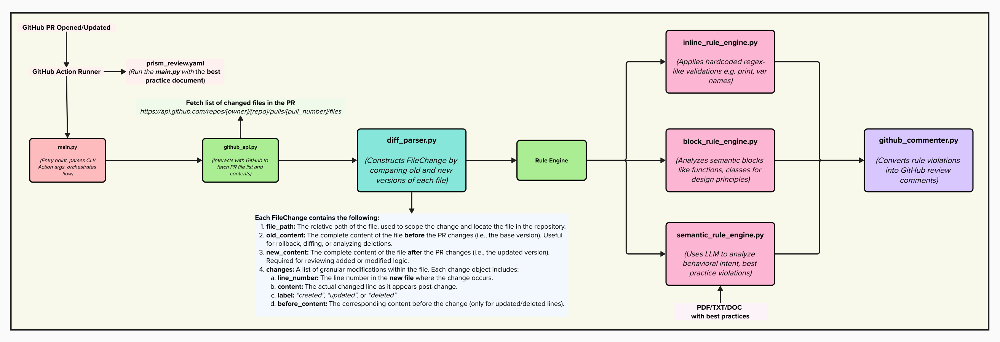

# PRism — PR Intelligent Semantic Moderator

**PRism** is an intelligent GitHub review bot that automates backend best practice validation on pull requests. It goes beyond simple diff checks by comparing old vs. new file versions, semantically analyzing the intent of changes, and surfacing actionable feedback using rule-based and LLM-powered engines.

Like a prism breaks down light to reveal its true spectrum, **PRism** dissects pull request changes to reveal hidden flaws, design violations, and coding inefficiencies.

---

## What's New in This Strategy?

Instead of analyzing *only changed lines*, PRism now compares the full context of file changes — including old content, new content, and a structured list of granular changes. This empowers three distinct engines:

* **Inline Engine**: Fast, regex-based validations (e.g., `print()`, bad variable names).
* **Block Engine**: Looks at logical code blocks (functions, classes) for structure/design issues.
* **Semantic Engine**: Uses LLM to evaluate behavioral intent and higher-order best practices.

---

## Motivation

Manual code reviews are error-prone, inconsistent, and time-consuming. Most PR comments are repetitive and can be automated. PRism addresses this by offering:

* Consistent enforcement of best practices.
* Instant, contextual feedback.
* Support for evolving and custom rule sets.

---

## The Problem

> There is no automated way to contextually evaluate *why* and *how* code has changed in a PR, which leads to missed violations and subpar reviews.

---

## The Vision

An **intelligent PR review assistant** that:

* **Parses full diff contexts** (old + new versions).
* **Classifies change types** (added, updated, deleted).
* **Executes three review layers**:

  * Regex inline rules
  * Structural block validations
  * LLM-based semantic review
* **Posts inline comments automatically** to GitHub.

---

## Workflow Overview



---

## New Project Structure

```plaintext
PRism/
├── assets/
│   ├── docs/
│   │   └── best_practice_guidelines.pdf  # Best practice guidelines
│   └── images/
│       └── PRism_Flowchart.png           # Updated architecture diagram
│
├── config/
│   └── rules.yaml                        # Hardcoded + custom best practice rules
│
├── src/
│   ├── api/
│   │   └── github_api.py                 # GitHub API abstraction
│   │
│   ├── core/
│   │   ├── diff_parser.py                # Produces FileChange objects with full context
│   │   └── github_commenter.py           # Posts inline comments to GitHub
│   │
│   ├── rule_engine/
│   │   ├── inline_rule_engine.py         # Applies regex-based rules (e.g., bad patterns)
│   │   ├── block_rule_engine.py          # Applies rules on functions/classes
│   │   └── semantic_rule_engine.py       # LLM-based feedback engine
│   │
│   ├── llm/
│   │   └── rules_generator.py            # Converts best practice PDFs to rules.yaml
│   │
│   ├── utils/
│   │   ├── models.py                     # FileChange, ChangeType, etc.
│   │   ├── rule_loader.py                # Loads inline/block rules from YAML
│   │   ├── constants.py
│   │   ├── logger.py
│   │   └── url_parser.py
│
├── tests/
│   ├── api/
│   │   └── test_github_api.py
│   │
│   ├── core/
│   │   ├── test_diff_parser.py
│   │   └── test_github_commenter.py
│   │
│   ├── rule_engine/
│   │   ├── test_inline_rule_engine.py
│   │   ├── test_block_rule_engine.py
│   │   └── test_semantic_rule_engine.py
│   │
│   ├── llm/
│   │   └── test_rules_generator.py
│   │
│   └── utils/
│       ├── test_models.py
│       ├── test_rule_loader.py
│       └── test_url_parser.py
│
├── main.py                               # Entry point - used by CLI or GitHub Action
├── requirements.txt
└── README.md
```

---

## Rule Engine Layers

| Engine                    | Scope             | Example Rule                                     |
| ------------------------- | ----------------- | ------------------------------------------------ |
| `inline_rule_engine.py`   | Line level        | No `print()`, poor var names, `eval()`, etc.     |
| `block_rule_engine.py`    | Function/class    | Too many args, no return type, large method size |
| `semantic_rule_engine.py` | LLM understanding | Is logic redundant? Is structure misleading?     |

---

## How It Works

1. **Triggered on PR**.
2. `main.py` calls `github_api` → fetches PR files.
3. `diff_parser` generates `FileChange` objects with full context.
4. `Rule Engine` routes changes to all three validation engines.
5. Violations → piped to `github_commenter`.
6. GitHub shows inline suggestions.

---

## FileChange Format (Core Data Unit)

```json
{
  "file_path": "src/example.py",
  "old_content": "...",       
  "new_content": "...",       
  "changes": [
    {
      "line_number": 12,
      "content": "print('Hello')",
      "label": "created",
      "before_context": null
    },
    {
      "line_number": 28,
      "content": "if user.is_admin():",
      "label": "updated",
      "before_context": "if user.is_superuser():"
    },
    {
      "line_number": 35,
      "content": null,
      "label": "deleted",
      "before_context": "print('Temporary log line')"
    }
  ]
}
```

---