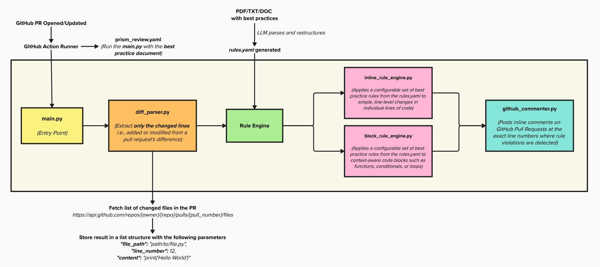

# What is PRism?

**PRism** is an automated review assistant bot designed to improve code quality and reduce the need for manual intervention during code reviews. It integrates with GitHub and is triggered **only during pull request events**. PRism scans code diffs and evaluates them against a set of predefined rules representing backend best practices. It then provides inline review comments directly in the pull request to guide developers in aligning with the standards.

Like a physical prism that reveals the full spectrum of light from a single beam, PRism reveals hidden insights within code changes—illuminating issues, encouraging consistency, and promoting best practices.

---

# Motivation

In modern software development, maintaining high code quality and adhering to engineering best practices is essential, especially in teams where code changes are frequent. Manual code reviews, while critical, are often time-consuming, inconsistent, and prone to oversight due to the subjective nature of human judgment.

I have noticed that common issues and anti-patterns repeatedly creep into codebases despite having well-established best practices. Manual reviews slow down the development cycle and vary in quality depending on the reviewer. I believe there is a better way to ensure consistent quality without relying solely on human effort.

---

# The Problem

> *There is no systematic, automated way to enforce backend engineering best practices during pull requests, resulting in inconsistent quality, delayed feedback, and over-dependence on manual review.*

---

# The Vision

I want to build an **automated review assistant bot** that:

* **Integrates directly into the GitHub development workflow**, triggering on pull request events.
* **Analyzes the code diffs** and checks them against a set of customizable best practice rules.
* **Adds review comments directly in the pull request**, suggesting improvements or highlighting violations.
* **Adapts to evolving practices** by allowing easy configuration of the ruleset.

This bot will act as a first-pass reviewer, helping developers catch issues early and focus human review efforts on deeper architectural or design feedback.

---

# MVP Goals and Scope

For the initial release of PRism, I plan to support the following features:

1. **Trigger only on `pull_request` events** (e.g., when a PR is opened or updated).
2. **Analyze code diffs** to identify only new or modified lines of code.
3. **Evaluate these diffs against a set of predefined rules** that capture backend best practices.
4. **Post inline comments directly on pull requests** when rule violations are detected.
5. **Support `Python` as the primary language** in the MVP phase.
6. **Seamless GitHub integration** to fit naturally into existing workflows.

---

# Architecture



---

# Project Structure

```plaintext
PRism/
├── assets/
│   └── PRism_Flowchart.png             # Architecture diagram
│
├── config/
│   └── rules.yaml                      # Best practice rules (user-defined or LLM-generated)
│
├── src/
│   ├── api/
│   │   └── github_api.py               # Fetch PR diff from GitHub API
│   │
│   ├── core/
│   │   ├── diff_parser.py              # Extracts added/modified lines from patch
│   │   └── github_commenter.py         # Posts review comments on GitHub PRs
│   │
│   ├── rule_engine/
│   │   ├── inline_rule_engine.py       # Applies rules to individual lines
│   │   └── block_rule_engine.py        # Applies rules to logical code blocks
│   │
│   ├── llm/
│   │   └── rules_generator.py          # Generate rules.yaml using LLM
│   │
│   └── utils/
│       ├── models.py  
│       ├── rule_loader.py  
│       ├── constants.py                # All constant keys and patterns
│       ├── logger.py                   # Custom logger
│       └── url_parser.py               # Parses PR URLs to extract metadata
│
├── tests/                              # Unit tests organized by module
│   ├── api/
│   │   └── test_github_api.py          # Unit tests for GitHub API client
│   │
│   ├── core/
│   │   ├── test_diff_parser.py         # Unit tests for patch line extraction
│   │   └── test_github_commenter.py    # Unit tests for GitHub PR commenting
│   │
│   ├── rule_engine/
│   │   ├── test_inline_rule_engine.py  # Tests for inline rule enforcement logic
│   │   └── test_block_rule_engine.py   # Tests for block-level rule evaluation
│   │
│   ├── llm/
│   │   └── test_rules_generator.py     # Tests for rules generated from best-practice docs
│   │
│   └── utils/
│       ├── test_models.py  
│       ├── test_rule_loader.py  
│       └── test_url_parser.py          # Tests for GitHub PR URL parsing utility
│
├── main.py                             # Entry point for CLI / GitHub Action runner
├── requirements.txt                    # Python dependencies
└── README.md                           # Project documentation

```

---

# 🔑 Key Features

* **Rule-driven engine**: Enforces a configurable list of backend best practices.
* **Diff-based scanning**: Focuses review only on the code that has changed.
* **Inline commenting**: Posts contextual feedback as comments in the pull request.
* **Extensibility**: New rules can be added or updated with minimal effort.
* **Language-aware analysis**: Starts with backend languages (initially Python).
* **CI/CD compatible**: Built to work naturally with GitHub Actions.

---

# Example Scenario

A developer raises a pull request to merge changes from a feature branch. PRism is triggered, scans the diffs, and identifies that a method uses `print()` for logging instead of the approved logging framework. It also flags a function that lacks input validation. The bot posts inline comments on these issues, recommending changes as per the defined standards. The developer receives instant, actionable feedback — even before a human reviewer begins their review.
